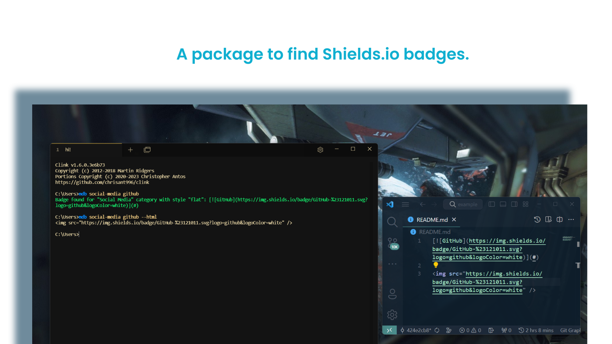
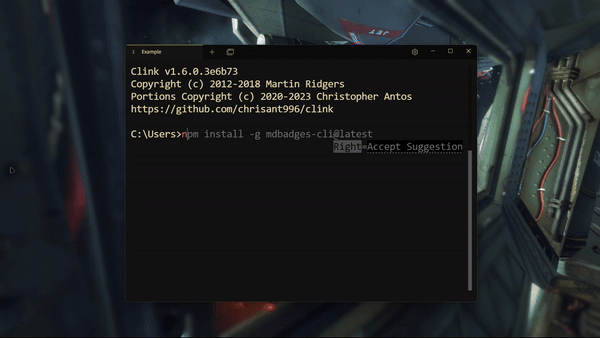

<div align="center">

 

# mdbadges-cli

[](https://github.com/inttter/mdbadges-cli/releases/ "The latest releases, with changelogs.")
[](https://www.npmjs.com/package/mdbadges-cli/ "The amount of downloads using NPM, per week.")
[](https://github.com/inttter/mdbadges-cli/blob/main/LICENSE/ "The legal stuff related to this package.")



<br>

[](https://github.com/inttter/mdbadges-cli/issues/ "Click here to open an issue") 
[](https://github.com/inttter/mdbadges-cli/issues/ "Click here to submit a pull request")
[](https://www.npmjs.com/package/mdbadges-cli/ "Click here to view the NPM page.")

</div>

# What is this?

This is an **NPM** package to easily find Shields.io badges — now with many additional features to improve functionality and usage, directly from the command line.

# Features
| |                          |
|---------|---------------|
🤏 | Small in size ─ **~200KB gzipped!**
📦 | **Low** amount of dependencies
👥 | **Wide range** of badges to search from
🎨 | **5** different Shields.io styles to select from
✏️ | Select between **Markdown** and **HTML**
🔎 | Search for badges in over **30+** categories
🕵️ | Search for **all** available categories
😎 | Create your **own** custom badges
🎲 | Generate a **random** badge
🩳 | Shortened aliases for many commands

# Installation

To install the latest version via NPM globally, do:

```bash
npm install -g mdbadges-cli@latest
```

> [!NOTE]
> You can drop the **-g** tag if you'd like to only install it in your workspace.

<div align="center">
    
    
###### Terminal: https://tabby.sh
</div>

<br>

**View changelogs between versions [here](https://github.com/inttter/mdbadges-cli/releases).**

# Demo

https://github.com/inttter/mdbadges-cli/assets/73017070/8127217f-aa85-447a-82b8-aa80873f5fcc

# Documentation

Documentation for **mdbadges-cli** can be found [**here**](https://inttter.gitbook.io/mdbadges-cli/).

# Commands

When using commands, use the prefix ```mdb```, and then add the comamnd name after it.


|   Command      |    Description    |     Aliases      | Additional Information |
|----------|-----------|---------------------------|--------|
```mdb <category> <badgeName>``` | Displays Markdown for specified badge in a category | N/A | Prefixes available: ```--style```, ```--html```, ```-s```
```mdb search <category>``` | Displays badges available in a [category](#list-of-available-categories) | ```s```, ```find```  | Instructions for how to get the code are in the comand.
```mdb lookup <query>``` | Displays badges containing a certain keyword/phrase | ```l``` | Displays name and category of bagde.
```mdb categories``` | Displays a list of all available categories | ```cat``` | N/A
```mdb create``` | Displays prompts to create your own badge | N/A | All fields require an answer
```mdb random``` | Displays a random badge. | ```r``` | Displays both Markdown and HTML formats.
```mdb copy <category> <badgeName>``` | Copies a badges' code to the clipboard | ```c``` | You can do <kbd>⊞ + V</kbd> on Windows to verify it's been copied.
```mdb badges``` | Displays links containing the full list of badges | ```list``` | N/A

# Miscallenaous Commands

These commands are not **very** important, but can serve useful in some cases.

|   Command      |    Description    |     Aliases      | Additional Information |
|----------|-----------|---------------------------|--------|
```mdb version``` | Displays the current version you are on | ```v``` | Do not use this command to update. This is for checking your version, use ```mdb update``` (see below) to update
```mdb update``` | Checks for updates to the package | ```upd``` | If a new version is available, it will prompt you to enter an ```npm``` update command
```mdb fund``` | Displays funding/donation links for the package | N/A | You don't have to donate, but I'd appreciate it!
```mdb about``` | Displays general information about the package | N/A | Also shows links to the website, GitHub issues, contributing, and more
```mdb contribute``` | Displays information on how to contribute | ```contrib``` | Links to the contributing guidelines

# Viewing commands from the terminal

Need to find what these commands do while your in the terminal? Run ```mdb -h``` to view all commands, aliases, and additional options.

# List of available categories

Below you'll find categories that are currently available, with the name and syntax needed in these commands for the ```<category>``` section:

```
mdb <category> <badgeName>

mdb search <category>

mdb s <category>

mdb find <category>
```
> [!TIP]
> Want to add your own **badge** or **category**? Contribute to [**this**](https://github.com/inttter/md-badges) repository!

| Name | Syntax |
|---------|---------------|
App Stores | app-store
Artificial Intelligence | artificial-intelligence
Blog | blog
Browser | browser
Cloud Storage | cloud-storage
Cloud System | cloud-system
Code Coverage | code-coverage
Collaboration Tools | collaboration-tools
Cryptocurrency | cryptocurrency
Database | database
Design | design
Documentation | documentation
Education | education
Funding | funding
Framework | framework
Game Engine | game-engine
Gaming Storefronts | gaming-storefront
Game Engine | game-engine
IDE/Code Editor | ide-code-editor
Office | office
Operating System | operating-system
Package Manager | package-manager
Payment | payment
Programming Language | programming-language
Restaurant/Delivery | restaurant-and-delivery
Search Engine | search-engine
Social Media | social-media
Sound | sound
Static Site | static-site
Video Streaming | video-streaming
Virtual Reality | virtual-reality
Web Technology | web-technology
Work/Jobs | work-and-jobs

###### ©️ Licensed under the [MIT License](LICENSE).
###### ©️ Shields.io is licensed under the [CC0-1.0 License](https://github.com/badges/shields/blob/master/LICENSE).
