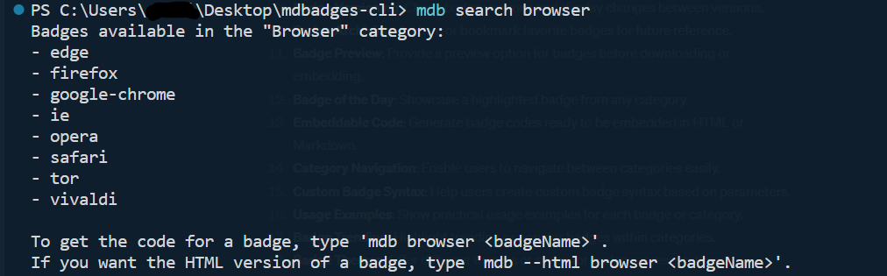
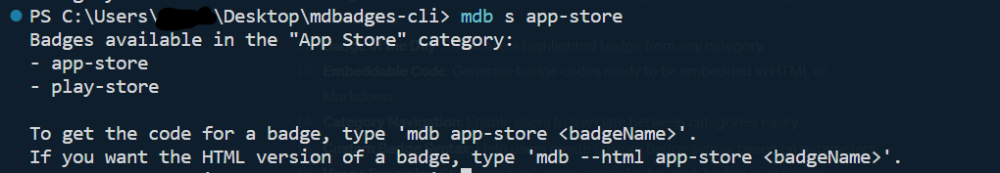
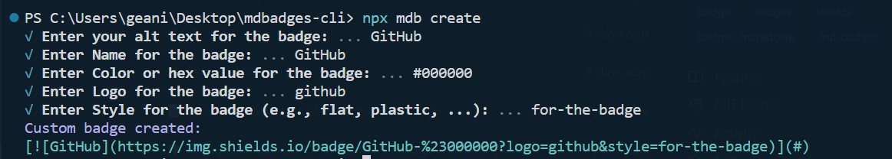

<div align="center">


# mdbadges-cli

[](https://www.npmjs.com/package/mdbadges-cli) [](https://github.com/inttter/mdbadges-cli/releases) [](LICENSE) [](https://www.codefactor.io/repository/github/inttter/mdbadges-cli)

A command line tool to find Shields.io badges.

</div>

> [!IMPORTANT]
> This package uses badges from my other project, **md-badges**. If you'd like to add a new badge, please visit [**this repository**](https://github.com/inttter/md-badges).

# Installation

To install the latest version via NPM, do:

```
npm install mdbadges-cli@latest
```

# Demo

<video controls="" height="auto" width="100%"><source src="https://cdn.discordapp.com/attachments/892836872118763543/1193250564537061486/mdb-category-name_example.mp4?ex=65ac0830&is=65999330&hm=06a318b5854b2dfd68cef2142f73bf20f90aee4d9471cb2b7401e521f0366e24&">Your browser does not support the video tag.</video>

# Usage: 

## To find a badge:

```
mdb <category> <badgeName>

e.g. | mdb browser firefox
```

Result: [](#)

If a badge is found in that category, it will output the required Markdown.

---

✨ **2.0.0+** | To find HTML, add ```--html``` after ```mdb```:

```
mdb --html <category> <badgeName>

e.g. | mdb --html work-and-jobs upwork
```

**Result:** 

---

✨ **2.1.0+** | To customise the style of the badge , add ```--style``` after your original command:

```
mdb <category> <badgeName> --style <style>

e.g. | mdb programming-language javascript --style for-the-badge
```
**Result:** [](#)

---

## To search for badges in a specific category:

```
mdb search <category>

e.g. | mdb search browser
```

**Result:** 



This command will display the badges available in that category, and you can then type the command above with a valid category and badge name to display the Markdown.

You can also do the shorter version of this command:

```
mdb s <category>

e.g. | mdb s package-managers
```
**Result:** 



---

## To view the full list of badges from the command line, do:

```
mdb badges
```

Alternatively, you can visit the following two links without doing the command:

https://github.com/inttter/md-badges

https://docs.inttter.com/content/badges

---

## To check for updates:

```
mdb update
```

This command uses Axios to determine if your package version is out-of-date.

You can also do the shortened version of this command:

```
mdb upd
```

---

## To view the list of available commands from the command line:

```
mdb help
```

> [!NOTE]
> You can also use ```-h``` after typing ```mdb``` to view the shortened commands.

---

## To view the (current) list of categories in the command line:

```
mdb categories
```
or
```
mdb cat
```

This command displays the list of current badge categories in the command line.

> [!NOTE]
> When typing a category name that has a space, make sure to include a ```-``` in the place of the space.

---

## To create your own badge with custom parameters:

```
mdb create
```

This command will let you create the...
* Alt Text
* Name
* Color
* Logo
* Style

...of the badge.

Here's an example of how you could create a GitHub badge with the ```for-the-badge``` style.



**Result:** [](https://github.com)

> [!IMPORTANT]
> You need to replace **(#)** with the URL that you'd like the badge to lead to when clicked on.
>
> In the example above, it leads to the GitHub website.

---

## To generate a random badge:

```
mdb random
```
and
```
mdb r
```

This command will output a random badge, in both its Markdown and HTML format.

---

## To view information about this package:

```
mdb info
```

---

# List of available categories:

Below you'll find categories that are currently available, with the name and syntax needed in these commands for the `<category>` section:

```
mdb <category> <badgeName>
```
or:
```
mdb search <category>

and:

mdb s <category>
```


| Name | Syntax |
|---------|---------------|
App Stores | app-store
Artificial Intelligence | artificial-intelligence
Blog | blog
Browser | browser
Cloud Storage | cloud-storage
Cloud System | cloud-system
Code Coverage | code-coverage
Collaboration Tools | collaboration-tools
Cryptocurrency | cryptocurrency
Database | database
Design | design
Documentation | documentation
Education | education
Funding | funding
Framework | framework
Game Engine | game-engine
Gaming Storefronts | gaming-storefront
Game Engine | game-engine
IDE/Code Editor | ide-code-editor
Office | office
Operating System | operating-system
Package Manager | package-manager
Payment | payment
Programming Language | programming-language
Restaurant/Delivery | restaurant-and-delivery
Search Engine | search-engine
Social Media | social-media
Sound | sound
Static Site | static-site
Video Streaming | video-streaming
Virtual Reality | virtual-reality
Web Technology | web-technology
Work/Jobs | work-and-jobs

###### ©️ Licensed under the [MIT License](LICENSE).
###### ©️ Shields.io is licensed under the [CC0-1.0 License](https://github.com/badges/shields/blob/master/LICENSE).